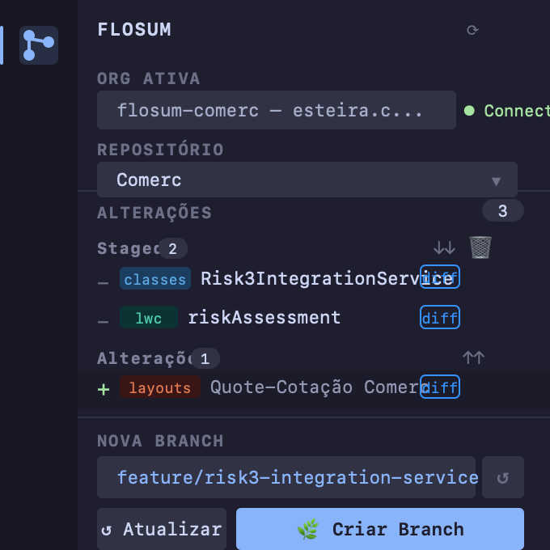

# Flosum Branch Creator

[](https://marketplace.visualstudio.com/items?itemName=icarvagu.flosum-branch-creator)
[](LICENSE)

A VS Code sidebar extension for [Flosum](https://flosum.com) DevOps — manage branches, push metadata and retrieve changes directly from VS Code, without leaving the editor.



---

## Features

### Staged / Changes view
Exactly like VS Code's Source Control — items detected from `git status` appear in **Changes**. Click `+` (or the item) to stage what you want to push. Click `−` to unstage. Stage all with `↑↑`, unstage all with `↓↓`.

### Smart branch name suggestion
The branch name is auto-generated from the staged Salesforce metadata (`AccountTrigger` → `feature/account-trigger`). Fully editable before creating.

### Selective push
Only the staged files are pushed to Flosum — not the entire `force-app/main/default`. Uses a temporary directory behind the scenes, so your project structure stays clean.

### Git commit after push
After a successful push, the extension automatically runs `git add + git commit` for the same files, keeping your local codebase in sync.

### Retrieve branch
Click **Checkout** on any branch in the list to pull its metadata from Flosum straight into `force-app/main/default`.

### Diff support
Every item has a **diff** button that opens VS Code's native diff editor (HEAD vs working tree).

### Discard changes
Discard individual items or all staged files with the 🗑 button. Works correctly with filenames containing spaces, accents and special characters.

### Auto-refresh
The sidebar updates automatically when you save a file or when files change on disk — no manual refresh needed.

### Org + Repository selector
Switch between authorized Salesforce orgs and Flosum repositories directly from the sidebar. Connection status is shown inline next to the org dropdown.

### Collapsible log
Click the **Log** header to collapse/expand the log panel.

### i18n
UI automatically adapts to your VS Code language: **Portuguese (pt-BR)** or **English**.

---

## Requirements

| Tool | Install |
|------|---------|
| [Salesforce CLI (`sf`)](https://developer.salesforce.com/tools/salesforcecli) | `npm install -g @salesforce/cli` |
| [Flosum SF CLI plugin](https://flosum.com) | Installed via Flosum setup |
| Flosum org authorized | `sf org login web --alias flosum-org` |

Your project must have a `sfdx-project.json` (standard Salesforce DX structure).

---

## Setup

1. **Authorize your Flosum org:**
   ```bash
   sf org login web --alias flosum-org
   sf config set target-org flosum-org
   ```

2. **Open the Flosum sidebar** — click the branch icon in the Activity Bar.

3. **Select your org and repository** from the dropdowns at the top.

---

## Usage

```
1. Edit Salesforce metadata locally (classes, triggers, LWC, flows…)
2. Files appear automatically in "Changes"
3. Click + on the items you want to push → they move to "Staged"
4. Edit the branch name (or use the auto-suggestion)
5. Click 🌿 Create Branch
   → Creates the branch in Flosum
   → Pushes only staged files
   → Runs git commit for the same files
```

### Retrieve a branch
In the **Branches Flosum** section, click **↺** to load the list, then **Checkout** on any branch to pull its metadata locally.

### Discard changes
- Hover any item → click 🗑 to discard that item only
- Click **🗑 Discard staged** to discard everything in Staged

---

## Known Limitations

- Requires the Flosum SF CLI plugin (`sf flosum`) to be installed
- Branch list uses SOQL — requires Flosum package in the org
- Diff only works for tracked files (not new untracked files)

---

## License

[MIT](LICENSE) © Igor Carvalho Guedes
